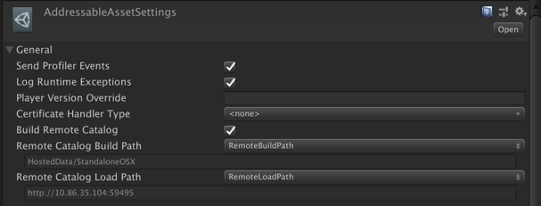
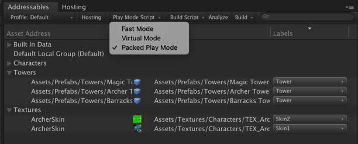
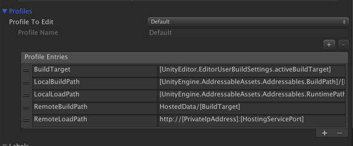
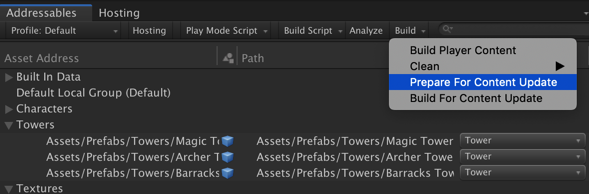
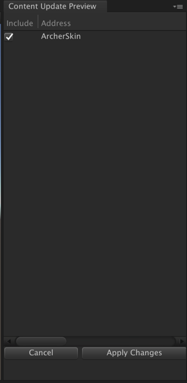
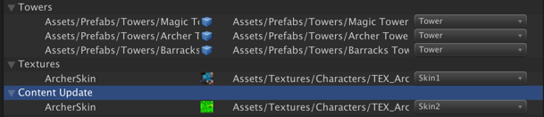
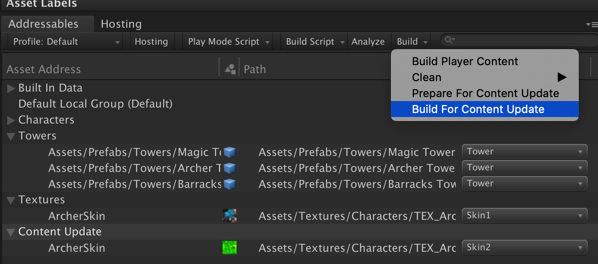
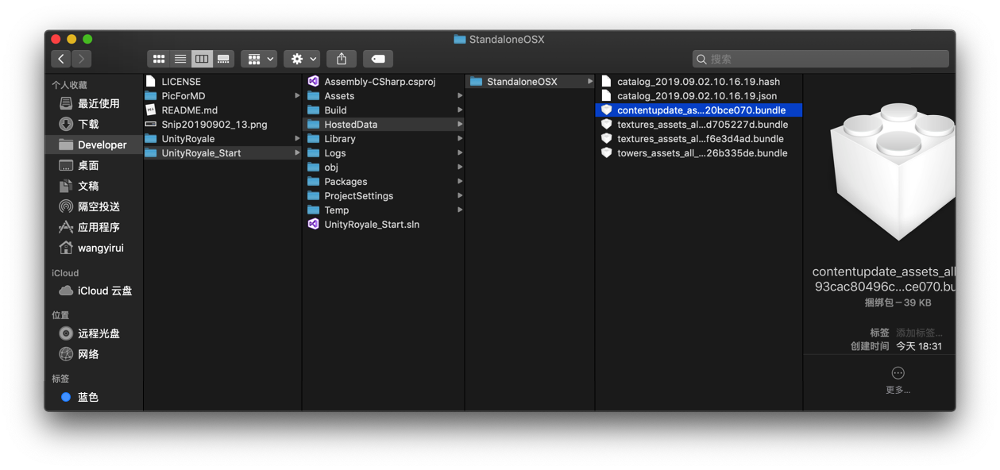
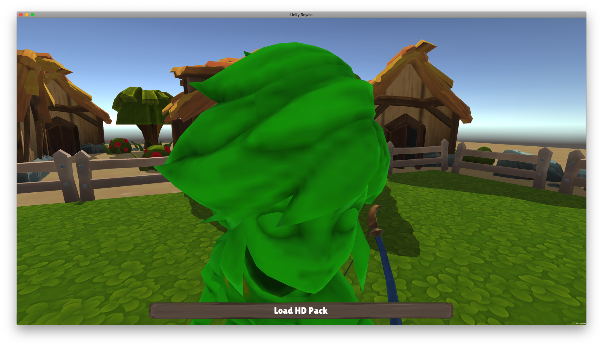

## Addressable Asset System Webinar

### Project Details
* Unity 2019.1.14f1
* Addressables 1.1.7
* [See the manifest for full details](https://github.com/Unity-Technologies/AddressableAssetsWebinar/blob/master/00_BaseProject/Packages/manifest.json)

### Q&A
* Can Asset Bundles be released once they are no longer needed? 
**There is a feature coming up to clean up unused bundles. Right now depends on the cache settings**.

* Are Asset Bundles and Groups the same thing?
**TBA**

### Useful links:
* [达哥直播：Addressable Asset System 全新资源管理流程](https://www.bilibili.com/video/av65819074?from=search&seid=2558299560706294789)
* [Addressables Samples](https://github.com/Unity-Technologies/Addressables-Sample)
* [Addressable Assets Manual](https://docs.unity3d.com/Packages/com.unity.addressables@0.4/manual/index.html)
* [Power Point File](https://drive.google.com/file/d/18BYrm4mgurjNgvjFYOtWgRfVGG6q5E1p/view?usp=sharing)
* [UniteLA Presentation on Addressables Video](https://www.youtube.com/watch?v=U8-yh5nC1Mg)

### Notes:

#### AddressableAssetSettings

- **Send Profiler Events**
  - [x] 可以在 Adressable Profiler 里面查看内存中的各个 Addressable Assets 的个数。
- **Profiles** 
  - \+ Profile Name：Development
  - Profile To Edit：Development（服务器的设置）

- **Labels**
  - \+ Labels：Towers

#### 查询机制

先把清单取出来，再根据清单决定哪些需要 Load 进来，哪些不需要。

- **LoadResourceLocationsAsync(label)**
- **IResourceLocation**

#### 加载测试

##### Addressable

- **Play Mode Script**
  - Fast Mode
  - Virtual Mode：在本地段虚拟一个在服务端的功能。
  - Packed Play Mode：真的打包之后，在Unity中模拟一个服务器环境，研究加载有没有问题。

#### 本地 / 远端打包设置

可以生成许多不同的设置：测试服、正式服、VIP服等等

##### AddressableAssetSettings

- Local Build Path：本地端打包路径
- Local Load Path：本地端加载路径

以上两个路径应该一样。

- Remote Build Path：远端打包路径
- Remote Load Path：远端加载路径

以上两个路径有可能不一样。

远端打包路径应该在一个文件夹里。

远端加载路径应该通过一个 IP 或者一个 Pool。

Unity 提供 Hosting Services 功能，模拟一个服务器，使用此虚拟服务器来做打包。

测试步骤：

1. Fast Mode
2. 使用 Remote Build Path & Remote Load Path （使用Unity 提供 Host 功能模拟）
3. 使用 Remote Build Path & Remote Load Path （使用真实服务器地址）

#### 安装包与加载包设置

- 从 App Store 下载最小的 App
- 第一次启动时开始加载资料包

#### 利用 Label 设计换皮与各种功能包

- 换皮
- 低清纹理包
- 高清纹理包
- DLC
- 等等 ……

Textures - ContentUpdateGroupSchema - Static Content：[x]

#### 打包完修改

不用整个重新下载，只需要下载额外的修正包。

修改一个纹理贴图不需要下载整个50M的包，只要下载几十K的包。

更换好 Addressable 下的 Texture 后：

1. Build - Prepare For Content Update（渐进式加载）

   

2. 告诉它原本的设置：Assets - AddressableAssetsData - OSX - addressables_content_state.bin

3. 显示整个包里 ArcherSkin 更改了：

   

   

4. Build - Build For Content Update

5. 告诉它原本的设置：Assets - AddressableAssetsData - OSX - addressables_content_state.bin

6. 查看文件夹：

   contentupdate：更新旧的 textures_assets

   新的 textures_assets：只有156k，用于更新。

7. 不需要重新 build，直接运行程序

   

#### 一些观念

- Addressable 不是只有加载或是实例化，你可以查询该物件在哪里。
- 系统会帮你处理关联性：将一整个 Scene，把它标记为 Addressable Assets。Initiate 或 Load 这个 Scene 时，把整个 Scene 加载进来。会把 Scene 中的很多 Assets，会把这些 Assets 里的相对关系、关联性找出来，从全部的包体里加载与这个 Scene 相关的 Assets 。（查看项目 MainMenu 场景的 SceneManager 。）
- Build Script 可以让你自己写打包流程：换成自己的打包流程、命名规则、额外处理。默认情况下用LZ4压缩算法，可以自己额外做处理。
- Addressables 是基于 Asset Bundle 架构做的高阶流程。依然是 Web Request 流程，更安全、更高阶。
- 未来会朝向以 Addresaables 为主

#### 旧系统如何转移

- **直接转移**
  - public GameObject XXX 改为 public AssetReference XXX；
  - Instantiate() 改为 AssetRefName.InstantiateAsync()；
  - 加载用 LoadAssetAsync\<GameObject\>()
- **Resources**
- **Asset Bundles**

